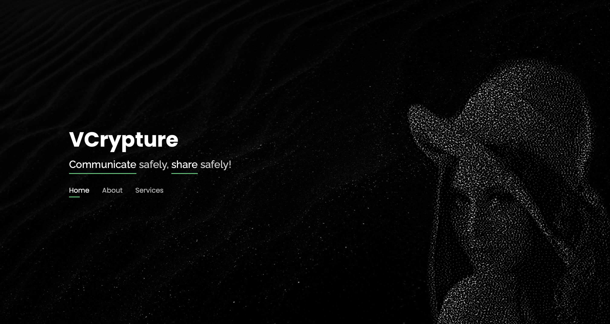
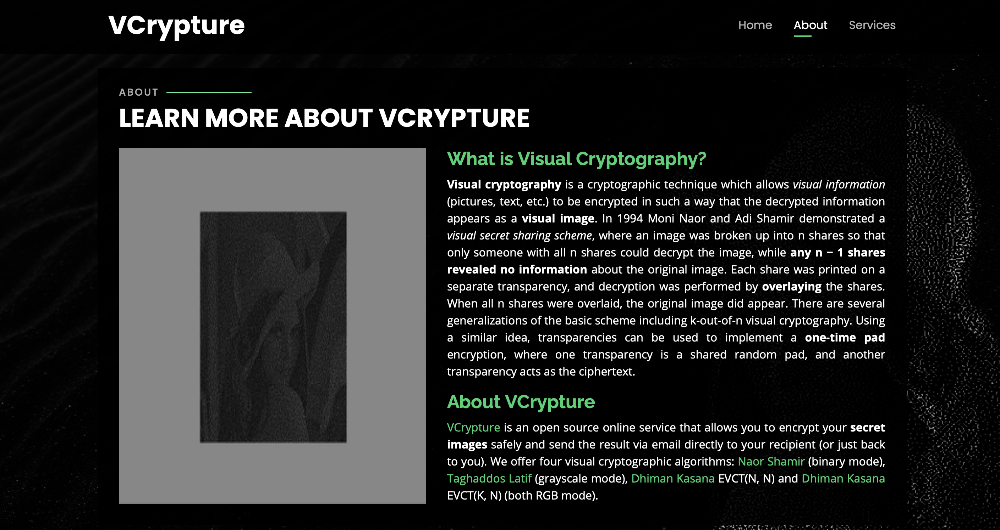
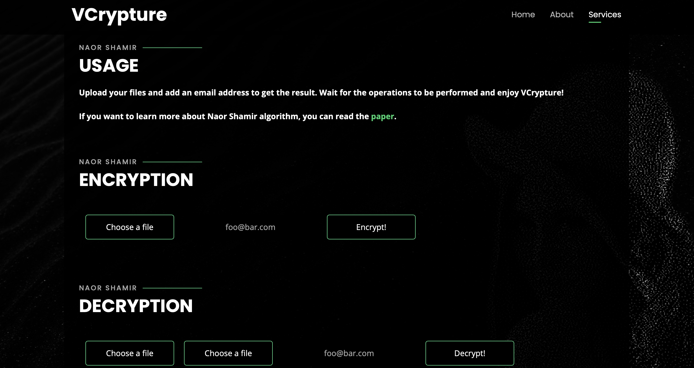
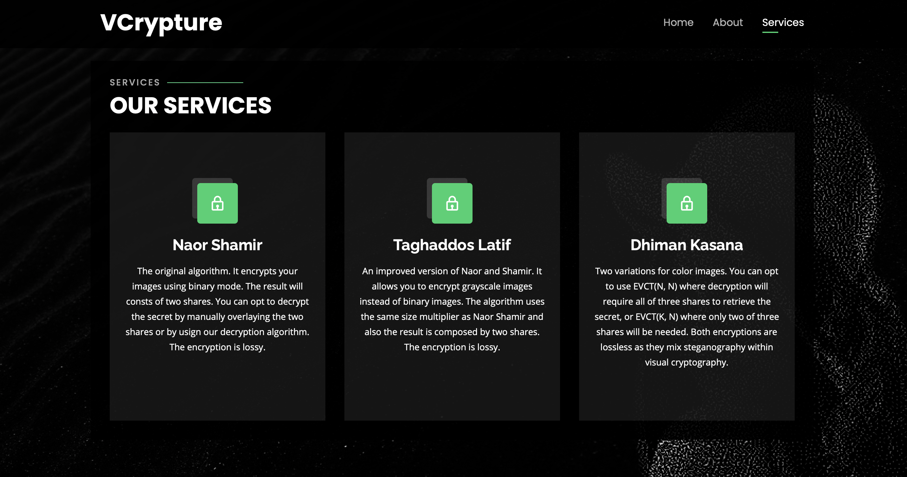

# VCrypture



**VCrypture** is an online service that allows you to encrypt your **secret images** safely using visual cryptographic algorithms.

> **What is Visual Cryptography?**
> *Visual cryptography is a cryptographic technique which allows visual information (pictures, text, etc.) to be encrypted in such a way that the decrypted information appears as a visual image.*

VCrypture is composed of two mainly parts: **VCrypture-API** and **VCrypture-Web**. The latter is a web server which provides the front-end as well as forwarding users' requests to the API core, whilst the former aims to perform visual cryptographic operations on images. 

## Features



VCrypture workflow is quite simple. The user can choose between four visual cryptographic algorithms - all visual cryptography schemes are described [below](#Visual-Cryptography-Schemes). Once the user uploads their secret image and specifies an email address, an email will be sent within a link to the encryption result or, in case of decryption operation, including the decrypted result as attachment.

  

## Visual Cryptography Schemes



### Naor Shamir

The first of this kind of algorithms. It encrypts your binary images and you will get two shares, both needed to decrypt the secret. Once you get the shares you can opt to decrypt the secret by manually overlaying the two images or by using our decryption form. The encryption is lossy because the original image is converted in binary mode to properly run the algorithm.

 

If you want to learn more about Naor Shamir algorithm, you can read the [paper](http://www.fe.infn.it/u/filimanto/scienza/webkrypto/visualdecryption.pdf).


### Taghaddos Latif

An improved version of Naor-Shamir scheme. It allows you to encrypt grayscale images instead of binary images. The algorithm uses the same size multiplier as Naor-Shamir and also the result is composed by two shares.


If you want to learn more about Taghaddos Latif algorithm, you can read the [paper](http://bit.kuas.edu.tw/~jihmsp/2014/vol5/JIH-MSP-2014-01-010.pdf).

### Dhiman Kasana

Two variations for color images (RGB). You can opt to use **EVCT(N, N)** where decryption will require all of three shares to retrieve the secret, or **EVCT(K, N)** where only two of three shares will be needed. That's because the former encrypts one color channel per share, so all shares are needed to reconstruct the pixel's original color. Instead, the latter encrypts two channels per share (RG, RB, GB), so you only need two shares to get the RGB color.

  

If you want to learn more about Dhiman Kasana algorithm, you can read the [paper](https://www.researchgate.net/publication/320228229_Extended_visual_cryptography_techniques_for_true_color_images).

## Dependencies

### VCrypture-API

*VCrypture-API* is developed in [Flask](https://flask.palletsprojects.com/). The main libraries and dependecies, which make this tool to work properly, are:

- [Flask-Mail](https://pythonhosted.org/Flask-Mail/) - a Flask extension to send emails
- [Flask-Executor](https://flask-executor.readthedocs.io/en/latest/) - a Flask extension to easily work with [concurrent.futures](https://docs.python.org/3/library/concurrent.futures.html#module-concurrent.futures)
- [Pillow](https://pillow.readthedocs.io/en/stable/) - a PIL (Python Imaging Library) fork
- [PyCryptodome](https://pycryptodome.readthedocs.io/en/latest/) - a self-contained Python package of low-level cryptographic primitives
- [Requests](https://requests.readthedocs.io/en/master/) - a simple HTTP library for Python

The API core also requires an SMTP server or an email account on a supported provider (i.e., Gmail), to actually return the results via email.

### VCrypture-Web

*VCrypture-Web* is a web application developed in [Node.js](https://nodejs.org/en/). The main libraries and dependecies, which make this tool to work properly, are:

- [Express](https://expressjs.com/) - a Node.js web application framework
- [express-session](https://www.npmjs.com/package/express-session) - an Express middleware for sessions management
- [node-redis](https://www.npmjs.com/package/redis) - a Node.js Redis client
- [redis-connect](https://github.com/tj/connect-redis) - descryption
- [node-fetch](https://www.npmjs.com/package/node-fetch) - a module that brings [Fetch API](https://developer.mozilla.org/en-US/docs/Web/API/Fetch_API) to Node.js
- [form-data](https://developer.mozilla.org/en-US/docs/Web/API/Fetch_API) - a library to create readable "multipart/form-data" streams
- [multer](https://www.npmjs.com/package/multer) - a Node.js middleware for handling multipart/form-data, primarily used for uploading files
- [csurf](https://www.npmjs.com/package/csurf) - a Node.js CSRF protection middleware
- [mustache-express](https://www.npmjs.com/package/mustache-express) - an Express template engine middleware
- [jQuery](https://jquery.com) - a cross-platform JS library to simplify client-side scripting
- [Bootstrap](https://getbootstrap.com) - a popular front-end framework

Also, a [Redis](https://redis.io/) installation is required to store Express sessions.

## Installation

You can choose whether to install VCrypture components separately or all-in-one by using Docker Compose. Also, both VCrypture-API and VCrypture-Web come with a Dockerfile to containerize each stand-alone component. Below we show all of the options to correctly install VCrypture. Although, we suggest to opt for the Docker-Compose solution for its simplicity.

### VCrypture-API

VCrypture-API requires [Python v3.8](https://www.python.org/downloads/release/python-385/)+ and [Flask v1.1.2](https://nodejs.org/en/blog/release/v14.7.0/)+ to run.

#### Manual Setup

In order to host the API core, edit the `settings.cfg.example` file with your own properties and remove the `.example` extension:

```cfg
WEB_ENDPOINT = <url>
STORAGE_FOLDER = <path>

EXECUTOR_TYPE = ('thread'|'process')
EXECUTOR_PROPAGATE_EXCEPTIONS = (True|False)

MAIL_SERVER = <SMTP_ADDRESS>
MAIL_PORT = <SMTP_PORT>
MAIL_USERNAME = <USERNAME>
MAIL_PASSWORD = <PASSWORD>
MAIL_DEFAULT_SENDER = <DEFAULT_SENDER>
MAIL_USE_TLS = (True|False)
```
Then open your terminal and execute these commands:
```sh
$ cd VCrypture/VCrypture-API
$ python3 -m venv venv
$ source venv/bin/activate
$ pip3 install -r requirements.txt
$ export FLASK_APP=app.py && export FLASK_ENV=development
$ flask run
```

#### Docker

VCrypture-API comes with a Dockerfile to be easily containerized using Docker. You also have to edit the settings file as described above to continue. Default port is 5050 but you can change it by editing the Dockerfile or by setting the `APP_PORT` environment variable.

```sh
$ cd VCrypture/VCrypture-API
$ docker build -t vcrypture-api .
$ docker run -d -p 5050:5050/tcp --name=vcrypture-api vcrypture-api
```

### VCrypture-Web

VCrypture-Web requires [Node.js v14.7.0](https://nodejs.org/en/blog/release/v14.7.0/)+, [Redis](https://redis.io) and [VCrypture-API](#VCrypture-API) to run.

#### Manual Setup

In order to host the web server, open your terminal and follow these steps:

```sh
$ git clone https://github.com/UniCT-WebDevelopment/VCrypture.git
$ cd VCrypture/VCrypture-Web
$ npm install
```

Edit the `config.js.example` file with your own properties and remove the `.example` extension:

```js
const apiIP = 'ip';
const apiPort = port;

module.exports = {
  app: {
    port: <port>,
    apiIP,
    apiPort,
    apiEndpoint: `http://${apiIP}:${apiPort}/api`,
    sessionConfig: {
      secret: '<keyboard cat>',
      resave: false,
      saveUninitialized: true
    }
  },
  redis: {
    host: '<redis_addr>',
    port: <redis_port>,
    ttl: 86400
  }
};
```

To start the web server execute:

```sh
$ npm run
```

#### Docker

VCrypture-Web comes with a Dockerfile to be easily containerized using Docker. Edit the `config.js.example` file and then follow these steps:

```sh
$ cd VCrypture/VCrypture-Web
$ docker build -t vcrypture-web .
$ docker run -d -p 80:80/tcp --name=vcrypture-web vcrypture-web
```

### Docker-Compose

VCrypture can be simply deployed by using docker-compose, as we provide the related Dockerfiles as well as docker-compose file. Build both images and then run the following command in the directory containing `docker-compose.yml`:

```sh
$ docker-compose up -d
```

It will create a Redis, a VCrypture-API and a VCrypture-Web docker container, starting from their images, and setup a network to make them communicate properly. Eventually, all the containers should be properly running and you can access VCrypture from a Web browser at the `localhost` address.

## Authors

This project was developed by [Mario Raciti](https://github.com/zMrDevJ) and [Giuseppe Tudisco](https://github.com/GTudisco), Computer Science students at Department of Mathematics and Computer Science, University of Catania, Italy. If you have any questions or suggestions feel free to contact us.

#### Contacts

- Emails: marioraciti@pm.me - giuseppetudisco96@gmail.com
- LinkedIn: linkedin.com/in/marioraciti - linkedin.com/in/giuseppe-tudisco/

## Todos

- Add more visual cryptographic algorithms.
- Use a dedicated SMTP server.
- Add more options to retrieve results.

**Enjoy VCrypture!**
